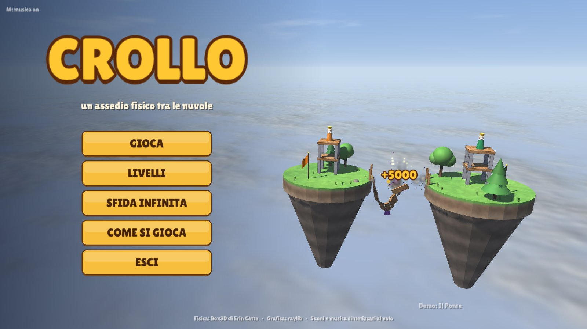
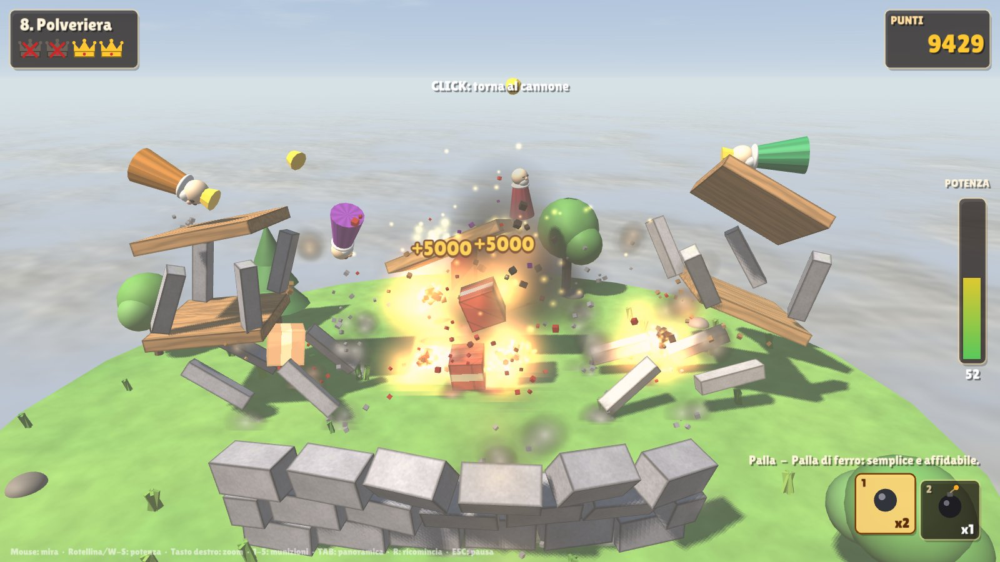
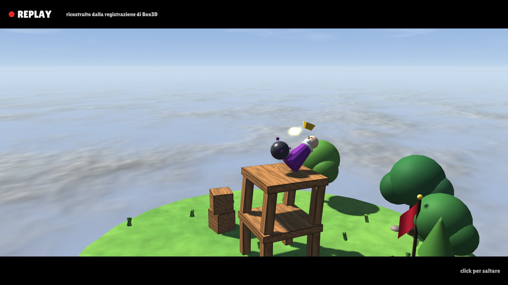
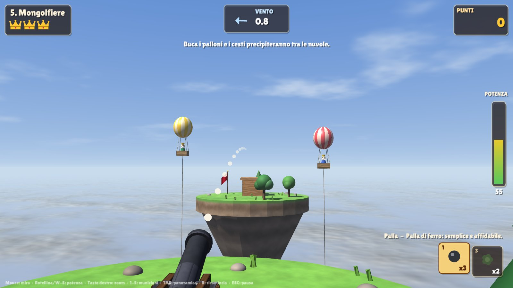
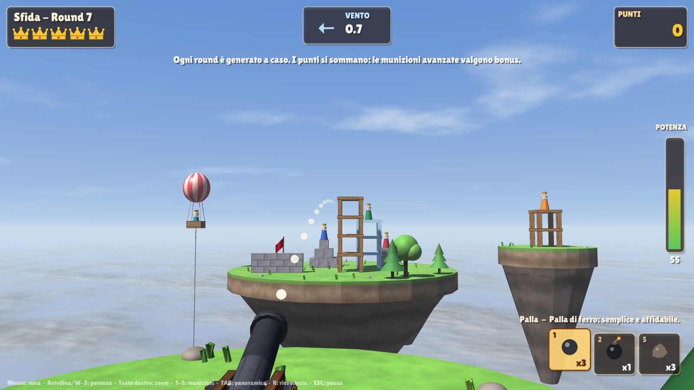

# CROLLO — un assedio fisico tra le nuvole

**Crollo** è un gioco d'assedio in 3D costruito attorno a [Box3D](https://github.com/erincatto/box3d), il motore fisico 3D di Erin Catto.
Su isole sospese sopra un mare di nuvole i re nemici si sono barricati in torri di legno, pietra e ghiaccio.
Hai un cannone e poche munizioni: falli cadere, ribaltare o colpiscili in pieno.



| | |
|---|---|
|  |  |
|  |  |

## Il gioco

- **60 livelli** fatti a mano, ognuno costruito attorno a una caratteristica diversa di Box3D:
  1. *Primo Colpo*: tutorial, una torre di legno.
  2. *Mura di Pietra*: un muro alto 2,5 m nasconde un terzo re: va scoperto (volo d'apertura o TAB) e raggiunto di pallonetto o con la bomba.
  3. *Il Ponte*: ponte di corda fatto di assi e giunti sferici che **si spezzano** se sovraccaricati.
  4. *Palazzo di Ghiaccio*: blocchi di ghiaccio scivolosi che si **frantumano** in otto schegge.
  5. *Mongolfiere*: re in cesti appesi a palloni con gravità negativa, ancorati con corde; buca i palloni.
  6. *Il Mulino*: pale mosse da un **giunto rotoidale motorizzato** che deviano i colpi; il **macigno** le spezza.
  7. *Il Pendolo*: una palla d'acciaio appesa a un **giunto di distanza**, con il vento contro.
  8. *Polveriera*: casse di TNT in una **casamatta indistruttibile** (corpi statici): si entra solo dalla feritoia.
  9. *Scudi Mobili*: lastre di pietra su **giunti prismatici** con molla che scorrono avanti e indietro, davanti al portone **rinforzato** che solo il macigno sfonda; il vento cambia a ogni colpo.
  10. *La Cittadella*: tre isole, sei re, tutto l'arsenale e un **vento che cambia a ogni colpo**.
  11. *Cristalli Guardiani*: **scudi di cristallo** che si spengono e si riaccendono a orario fisso; conta il momento dello sparo.
  12. *Doppia Guardia*: due scudi in fila con ritmi diversi, una cupola sopra una torre, un re raggiungibile solo di pallonetto.
  13. *Sponde di Gomma*: un re sotto una tettoia, raggiungibile solo di rimbalzo su un muro di **gomma** inclinato; **sacchi di sabbia** che inghiottono i colpi.
  14. *Il Bunker*: una torre chiusa fra i sacchi di sabbia, da abbattere con il **Vortice** o la **bomba adesiva**; le esplosioni non passano la gomma.
  15. *Crepacci*: re su **ponti di ghiaccio** sospesi fra guglie di roccia, riparati da un muretto: si colpisce il ponte.
  16. *Curling*: un re chiuso in una casa di pietra **fissa** (corpi statici); due **pietre da curling** in fila: la spinta passa dall'una all'altra, che scivola sotto il muro.
  17. *Stalattiti*: pesanti **tetti di neve** su tre colonne di ghiaccio; spezzata la colonna davanti, il tetto crolla sui re.
  18. *Valanga*: tre palle di neve trattenute su una rampa da una **diga di ghiaccio** saldata a due pali (**giunti di saldatura**).
  19. *La Reggia di Ghiacciolo*: il finale dei Picchi Gelati, con scudo di cristallo, tetto di neve e pista da curling.
  20. *Doppio Curling*: due re nella casa, con **sponde di legno** che riportano la pietra verso il suo re.
  21. *Curling dei Campioni*: due re e nessuna sponda.
  22. *Neve Fresca*: un **trabocchetto**: la stessa scena della Valanga, ma le palle di neve sono farinose e non abbattono nessuno.
  23. *Sfere Magiche*: una **barriera magica** respinge le palle di cannone e lascia passare le **sfere magiche** (filtro delle collisioni di Box3D).
  24. *Il Granaio*: muri di mattoni e un muro **cerchiato di ferro** che solo il macigno sfonda.
  25. *Due Mulini*: due mulini che girano in versi opposti, vento variabile.
  26. *Sponda Magica*: una sfera magica da mandare sul re di sponda, su un pannello di gomma.
  27. *Il Palazzo di Ottavia*: il finale della Valle dei Mulini, con tutto quello che la valle ha insegnato.
  28. *Il Boschetto*: tre re nascosti dietro i pini, sotto le chiome delle querce: gli **alberi** fermano palle ed esplosioni e solo la palla incatenata li taglia.
  29. *La Carovana*: un re su un **tappeto volante**, un corpo **cinematico** che va e viene con pause alle estremità: si mira dove sarà.
  30. *Vetrate*: re in piena vista dietro il **vetro infrangibile** cerchiato d'ottone (disegnato in un passaggio trasparente a parte): solo di pallonetto.
  31. *Il Montacarichi*: re su **ascensori** dietro un muro, che spuntano solo in cima alla corsa.
  32. *Tappeti in Volo*: tre tappeti, uno dietro una lastra di vetro sospesa, e il vento che cambia a ogni colpo.
  33. *Miraggio*: le sfere magiche passano la barriera, ma davanti scorre una **lastra di vetro mobile**.
  34. *L'Oasi*: re dietro grandi **cactus** e sotto le **palme**; la catena taglia i cactus.
  35. *Tempesta di Sabbia*: dune di arenaria, montagne di sacchi, un tappeto in alto e vento forte e variabile.
  36. *Il Palazzo di Zaira*: il finale delle Dune: la Sultana su un tappeto dietro una facciata di vetro con i varchi, guardie sugli ascensori e un chiosco magico.
  37. *Il Bazar*: tre re e due soli colpi: il **grappolo** aperto al momento giusto prende i due re sulle colonne vicine.
  38. *Le Teche*: re chiusi in teche di vetro, tetto compreso: solo il **Vortice** attraversa il vetro e li risucchia.
  39. *Il Frutteto*: cinque re, due coppie, quattro grappoli.
  40. *La Cupola Stregata*: due torri sotto una cupola di barriera magica senza sfere: ci vuole il Vortice.
  41. *Il Faro*: il guardiano sta in una garitta di pietra aperta su un solo lato: si prende solo **di sponda**, su un pannello di gomma.
  42. *Isole alla Deriva*: tre re su **isole che fluttuano** (corpi cinematici che salgono, scendono e vanno alla deriva, con le torri sopra).
  43. *Le Ventole*: due **ventole** soffiano di traverso sulla linea di tiro: la corrente d'aria sposta di lato le palle.
  44. *Sponde Mobili*: un pannello di gomma **che scorre** e si allinea con la garitta solo per un attimo.
  45. *La Girandola*: una pala di gomma **che gira** manda il colpo in una garitta o nell'altra, secondo l'angolo.
  46. *I Soffioni*: re in pozzi murati, raggiungibili solo di pallonetto; un **soffione** sul fondo ributta in alto le palle quando soffia.
  47. *La Giostra*: una **piattaforma girevole** porta in giro tre re, ognuno con il suo muro.
  48. *Il Porto*: re nelle vetrine di vetro aperte su un lato, davanti a moli di gomma; una barca alla deriva e vento di traverso.
  49. *L'Occhio del Ciclone*: una colonna d'aria ascendente ferma i pallonetti sul re del pilastro; tre isole alla deriva e vento che cambia a ogni colpo.
  50. *La Rocca di Re Fulmine*: il finale dell'Arcipelago: il re si prende di sponda sulla pala che gira, poi un soffione, una vetrina e un'isola alla deriva.
  51. *La Leva*: un re sul braccio lungo di una **leva** su **giunto rotoidale con fine corsa**: un pallonetto sulla piastra d'ottone lo lancia in aria.
  52. *Il Maglio*: pesi di ferro appesi sopra i re; le corde sono legate a **bersagli d'ottone** che, colpiti, **distruggono il giunto** e sganciano il peso.
  53. *La Quintana*: due **fantocci girevoli**: si colpisce lo scudo e la mazza ferrata gira, attraversa la gabbia magica e colpisce il re.
  54. *Il Guinzaglio*: sfere magiche legate a un palo con una **corda** (giunto di distanza con limite): colpite, girano attorno al palo fino al re.
  55. *Il Contrappeso*: una catena: bersaglio, peso che cade, leva che lancia il re.
  56. *Scudi Orbitanti*: re dentro scudi di ferro (con il tetto) che girano: si spara quando passa il varco.
  57. *Il Carrello*: uno scivolo in tre tratti; quello di mezzo sta su un **carrello** (giunto prismatico con fine corsa e attrito) spostato in avanti: prima lo si spinge al suo posto, poi si manda in schegge il fermo e la sfera rotola fino al re. Nell'ordine sbagliato la sfera cade nel crogiolo.
  58. *Tre Corde*: un **trabocchetto**: tre pesi, tre bersagli e corde che si incrociano; uno dei pesi non sta sopra nessuno.
  59. *La Fonderia*: un fantoccio, una sfera al guinzaglio e un re negli scudi orbitanti.
  60. *La Forgia dell'Imperatore*: il finale: l'Imperatore di Ferro siede su una leva, e il bersaglio che sgancia il peso è protetto da scudi che girano.
- **Campagne**: i livelli sono divisi fra i regni del Regno di Sopra. Sei re hanno spezzato la Corona dei Venti che tiene
  in cielo le isole; ogni campagna ha il suo re, il suo bioma e un frammento da recuperare. La **mappa dei regni** apre
  una campagna quando nella precedente hai raccolto almeno metà delle stelle (e la lascia aperta se ci hai già vinto); dentro una campagna i livelli si sbloccano
  in ordine. Un prologo accoglie la prima visita, un epilogo chiude l'ultimo livello, e i sottotitoli dei livelli sono le
  provocazioni del re di turno.
  - *Prati Alti* (Re Bernardo il Tondo): livelli 1, 2, 3, 28, 5, 8, 13, 14 e 10 come finale.
  - *Valle dei Mulini* (Regina Ottavia): 6, 7, 24, 39, 23, 25, 9, 26, 40 e 27 come finale — tramonto, foglie al vento.
  - *Picchi Gelati* (Re Ghiacciolo III): 4, 15, 16, 11, 17, 18, 22, 20, 12, 21 e 19 come finale — neve e abeti.
  - *Dune Sospese* (Sultana Zaira): 29, 30, 31, 32, 33, 37, 34, 38, 35 e 36 come finale — sabbia, palme e cactus.
  - *Arcipelago delle Tempeste* (Re Fulmine): 41-49 e 50 come finale — pioggia, lampi e tuoni in lontananza.
  - *Fucina del Vulcano* (l'Imperatore di Ferro): 51-59 e 60 come finale — basalto sopra un mare di lava, braci che salgono.
- **Biomi**: colori del cielo, del mare di nuvole, della luce e delle isole passano allo shader come uniform; ogni regno ha
  il suo meteo (foglie, neve, sabbia, pioggia, braci) e il suo stile di musica.
- **Re sparsi**: in 46 livelli su 60 i re, con le torri, gli scudi e i ripari che li accompagnano, cambiano posto a ogni
  tentativo entro un piccolo perimetro (`Builder::Scatter`): la mira non si impara a memoria, e le munizioni sono più
  generose. Restano fissi i livelli costruiti su un colpo preciso (curling, Valanga, Neve Fresca, Crepacci, Polveriera,
  Pendolo) e i re legati a una sponda o a una sfera. I test usano la
  disposizione disegnata e altre cinque a caso.
- **Sfida infinita**: fortezze generate proceduralmente, sempre più difficili; i punti si sommano round dopo round e il record viene salvato.
- **7 munizioni**: palla di ferro, bomba (esplode all'impatto o con SPAZIO), grappolo (si divide in 7 con SPAZIO), palla incatenata (due sfere legate che ruotano e spazzano, l'unica che taglia gli alberi), macigno (convex hull irregolare, enorme e pesante), Vortice (implode e risucchia i blocchi verso il centro), bomba adesiva (si attacca a ciò che colpisce ed esplode dopo 3 secondi).
- **Replay del colpo decisivo**: dopo ogni vittoria il colpo viene *ri-simulato* dalla registrazione deterministica di Box3D e mostrato al rallentatore con una telecamera cinematografica (vedi sotto).
- Stelle in base ai colpi usati, bonus per le munizioni avanzate, progressi salvati.
- Tutto l'audio è **sintetizzato al volo**: effetti (cannone, legno, pietra, ghiaccio, esplosioni, "wooo" del re...) generati all'avvio, e una musica generativa per liuto (sintesi Karplus-Strong) con vento ambientale: ogni regno ha accordi, scala e tempo suoi
  (cadenza andalusa nei Prati Alti, fa maggiore caldo nella Valle, mi minore lento e acuto sui Picchi...).
- Grafica: shadow mapping con PCF, materiali procedurali nello shader (venature del legno, pietra, ghiaccio con fresnel, TNT, reticolo della barriera magica), vetro trasparente disegnato in un passaggio a parte dopo gli oggetti opachi, cielo con mare di nuvole procedurale in cui gli oggetti "affondano", particelle, slow motion, screen shake.
- **Alberi** solidi in ogni regno (querce e pini, palme e cactus nel deserto): fermano colpi ed esplosioni, e solo la palla incatenata li taglia: resta il ceppo e l'albero cade lontano dal cannone.
- **Vento**: dove soffia è un'accelerazione costante sui proiettili, indicata da una freccia; nelle Dune è fisso e le particelle di sabbia lo seguono, in alcuni livelli di altri regni cambia a ogni colpo.
- **Correnti d'aria**: ventole e colonne ascendenti spingono le palle solo dentro la loro zona, disegnata da scie d'aria; i
  soffioni soffiano a intermittenza.
- **Tiri di sponda**: la gomma può essere fissa, scorrere o girare (corpi cinematici); le palle rimbalzano e restano in
  volo, vento e correnti compresi. Con la mira assistita (T) la traiettoria prevista segue i rimbalzi e le correnti.
- **Isole che fluttuano e giostre**: corpi cinematici che portano con sé torri e re; tutto parte già in moto con loro.
- **Meccanismi della Fucina**: leve, fantocci girevoli, sfere legate, pesi appesi, carrelli su guide e scudi orbitanti.
  Le parti da colpire sono d'ottone; ogni pezzo ha un fine corsa, così l'esito non dipende dalla forza del colpo.

## Comandi

| Tasto | Azione |
|---|---|
| Mouse | ruota il cannone |
| Rotellina | potenza di 1 in 1 (con SHIFT di 5 in 5) |
| W-S | potenza continua (SHIFT: più lenta) |
| Click sinistro | spara (in volo: torna al cannone) |
| Click destro (tenuto) | cannocchiale |
| 1-7, Q/E | scegli la munizione |
| SPAZIO | abilità speciale del proiettile in volo |
| TAB | panoramica libera della fortezza |
| T | mira assistita (traiettoria completa con punto d'impatto) |
| R | ricomincia · O ombre · M musica · F11 schermo intero · ESC pausa |

## Compilare ed eseguire

Serve un compilatore C/C++ (C17/C++17), CMake ≥ 3.22 e una connessione internet al primo configure:
Box3D (a un commit fissato) e raylib 5.5 vengono scaricati automaticamente con `FetchContent`.

```bash
cmake -S . -B build -DCMAKE_BUILD_TYPE=Release
cmake --build build -j
./build/crollo
```

Su Linux servono gli header di X11/OpenGL/ALSA per raylib (su Ubuntu:
`sudo apt install libx11-dev libxrandr-dev libxinerama-dev libxcursor-dev libxi-dev libgl1-mesa-dev libasound2-dev`).
Il gioco è stato sviluppato e verificato su Linux; su Windows e macOS lo stesso procedimento CMake dovrebbe bastare, ma non l'ho provato.

Gli asset (un solo font, Lilita One, licenza OFL) vengono copiati accanto all'eseguibile dopo la build.

### Versione web (WebAssembly)

Con [Emscripten](https://emscripten.org) installato e attivato (`source emsdk_env.sh`):

```bash
emcmake cmake -S . -B build-web -DCMAKE_BUILD_TYPE=Release
cmake --build build-web -j
cd build-web && python3 -m http.server 8000   # poi apri http://localhost:8000
```

Escono tre file da pubblicare insieme: `index.html` (la pagina, generata da `web/crollo.html`), `crollo.js` e
`crollo.wasm` (~1,4 MB, con il font incorporato). Va servita da un server HTTP qualsiasi, non aperta come file.
La build web usa WebGL2 e gira su un solo thread (niente `SharedArrayBuffer`, quindi nessun header speciale lato server);
i salvataggi finiscono nel `localStorage` del browser. Nel browser ESC libera il mouse e mette in pausa; un click sulla
scena lo riaggancia.

### Strumenti di verifica inclusi

```bash
./build/crollo --debug                        # gioca con tutti i livelli sbloccati (i salvataggi non cambiano)
./build/crollo --cheat                        # colpi infiniti per provare i livelli (F9 in gioco; vittorie non salvate)
./build/crollo --autotest [colpi] [livello]   # headless: ogni livello (o solo quello indicato) è stabile e vincibile?
./build/crollo --autotest-challenge [round] [seed]  # lo stesso per le fortezze procedurali
./build/crollo --test-shields                 # la previsione degli scudi coincide con ciò che succede davvero?
./build/crollo --test-ammo                    # munizioni e materiali: gomma, sacchi, Vortice, adesiva, portoni, alberi,
                                              # tappeto volante, vetro, teca di vetro, rimbalzi previsti, ventole,
                                              # soffioni, leva, quintana, carrello... si comportano come previsto?
./build/crollo --test-campaigns               # campagne, sblocchi e migrazione dei vecchi salvataggi
./build/crollo --scan-shots [livello]         # quanti re può abbattere un colpo solo, per ogni munizione
./build/crollo --shot <modo> <livello> <frame> out.png   # screenshot (aim, fire, fireall, intro, title, map, select, story, outro, pause, howto, challenge)
./build/crollo --export-audio <cartella>      # esporta in WAV tutti i suoni sintetizzati e la musica di ogni regno
```

Lo scanner `--scan-shots` spara un colpo singolo con ogni munizione su una griglia di 15 punti sopra la fortezza e
segnala con `!!` i livelli in cui un solo colpo abbatte tutti i re (nei livelli 7 e 18 è voluto: pendolo e valanga;
oggi lo scanner lo trova solo nel 7, ma la Valanga si vince comunque con un colpo). Con `CROLLO_DEBUG=1` stampa anche l'esito di ogni singolo tiro.

Nei livelli in cui i re si abbattono indirettamente (pietre da curling, sfere magiche, colonne, diga, portoni) il livello indica all'IA dove
mirare con `Builder::AimHint`, così il test automatico e la demo del menu giocano come un giocatore che ha capito il
livello.

Con `select`, `story` e `outro` il numero del livello indica la campagna (0-5). La variabile d'ambiente
`CROLLO_BIOME=<0-5>` forza un bioma su qualunque livello, utile per gli screenshot e per regolare i colori.

### Salvataggi

`crollo_save.txt` (o il `localStorage` sul web) salva stelle e record per **id del livello** (`star prati_mura 3`), così
l'ordine dei livelli e delle campagne può cambiare senza perdere i progressi. I salvataggi vecchi, che usavano l'indice
(`level 1 3`), vengono letti e riscritti nel formato nuovo al primo salvataggio.

L'autotest carica ogni livello senza finestra, lascia assestare le strutture per 5 secondi (20 nei livelli con
piattaforme mobili: nessun re deve cadere da solo) e poi fa giocare un'IA che risolve la balistica in modo esatto
(gravità + vento come accelerazione costante) e sceglie la parabola facendo *ray cast* lungo la traiettoria, anche sul
fondo e sui fianchi della palla, per evitare gli ostacoli. Contro i bersagli mobili mira dove saranno quando arriva il
colpo e aspetta che si apra il varco; il grappolo lo apre a pochi metri dal bersaglio. Dove ci sono correnti d'aria
segue il volo passo per passo e corregge la mira finché la palla arriva sul re; per i tiri di sponda (`Builder::BankHint`)
cerca fra archi puntati su una griglia di punti delle facce di gomma e affina il migliore, con la stessa previsione
dei rimbalzi della mira assistita (fedele a Box3D entro 20 cm, controllata da `--test-ammo`). Nei livelli con i re sparsi
l'autotest gioca la disposizione disegnata e altre cinque a caso, e le deve vincere tutte. La stessa IA gioca la demo
nel menu principale.

## Come viene usato Box3D

| Funzionalità di Box3D | Dove nel gioco |
|---|---|
| Convex hull (`b3MakeTransformedBoxHull`, `b3CreateCylinder`, `b3CreateCone`, `b3CreateHull`) | blocchi, isole, re, corone, macigni irregolari |
| Sfere, corpi multi-shape | proiettili, re (tunica + testa), cesti, pale del mulino |
| Continuous collision (`isBullet`) | proiettili veloci che non attraversano le torri |
| `b3World_Explode` | bombe e TNT (con reazioni a catena); con impulso negativo è il Vortice, che implode e risucchia anche attraverso vetro e barriere |
| `explosionScale` per shape | i sacchi di sabbia ricevono solo un quarto della spinta delle esplosioni |
| `restitution` dei materiali | la gomma restituisce circa il 90% della velocità: tiri di sponda |
| Giunto `Weld` creato a runtime | la bomba adesiva si salda al corpo che colpisce |
| Contact hit events | suoni per materiale, polvere, rottura del ghiaccio, innesco del TNT, re colpiti |
| Contact begin events | la bomba esplode anche con un tocco leggero |
| Body move events | sincronizzazione efficiente delle trasformate da renderizzare |
| Joint events + `forceThreshold` | le corde del ponte si spezzano quando vengono sovraccaricate |
| Giunti sferici con molla | il ponte di corda |
| Giunto rotoidale con motore | il mulino |
| Giunto prismatico con molla e limiti | gli scudi mobili; il carrello dello scivolo (limiti e motore fermo come attrito) |
| Giunto rotoidale con limiti o con motore fermo come attrito | la leva e i fantocci della Fucina |
| `b3DestroyJoint` a comando | i bersagli d'ottone sganciano i pesi appesi |
| Corpi cinematici con `b3Body_SetTargetTransform` | tappeti volanti, ascensori e lastre di vetro che vanno e vengono, con pause e partenze dolci; gomma che scorre e gira, isole che fluttuano, giostre |
| Corpi statici che diventano dinamici a runtime | l'albero tagliato: il corpo fisso sparisce, restano un ceppo statico e un albero che cade |
| Filtri di collisione (categorie e maschere, `b3Shape_SetFilter`) | la barriera magica che lascia passare solo le sfere magiche; l'albero appena tagliato che per mezzo secondo lascia passare la catena |
| Giunto di distanza rigido e "a corda" (molla a 0 Hz + limite) | pendolo, palla incatenata, funi delle mongolfiere, ormeggi |
| `gravityScale` negativa, damping, forze | mongolfiere, vento e correnti d'aria sui proiettili |
| Ray cast (`b3World_CastRayClosest`, `b3World_CastRay` con filtro) | mira assistita e pianificazione della traiettoria dell'IA |
| `b3Body_Disable` / `b3Body_Enable`, `b3World_OverlapShape` | scudi di cristallo a tempo; uno scudo non si riaccende finché dentro c'è qualcosa |
| Sleep delle isole, multithreading (`workerCount`) | scene con centinaia di corpi a costo basso |
| **Recording & replay** (`b3World_StartRecording`, `b3CreatePlayer`, `b3RecPlayer_StepFrame`) | il replay del colpo decisivo |

### Il replay

A ogni colpo il gioco riavvia una registrazione Box3D: la registrazione parte da uno snapshot del mondo e annota ogni
mutazione (corpi creati e distrutti, forze, esplosioni, giunti spezzati) e ogni step. Dopo la vittoria un `b3RecPlayer`
ricostruisce quel mondo e lo ri-simula in modo deterministico (il player verifica anche l'hash dello stato a ogni step:
nelle prove fatte non è mai divergente). Ogni corpo ha come *nome* un numero seriale, che sopravvive alla registrazione, e il gioco lo
usa per ritrovare l'aspetto dell'entità originale, anche se nel frattempo è stata distrutta. Gli effetti che la fisica
non conosce (particelle delle esplosioni, stelline dei re) sono eventi con il numero di step, riprodotti allo step giusto;
i colpi del mondo ri-simulato generano i loro contact event, quindi suoni e polvere tornano da soli.

## Architettura

```
src/
  main.cpp       finestra, loop principale, modalità di test e screenshot
  game.cpp/.h    regole, cannone, proiettili, esplosioni, re, telecamere, schermate, HUD, IA, replay, sfida
  levels.cpp/.h  Builder (isole, torri, muri, ponti, mulini, pendoli, mongolfiere...), livelli, campagne e generatore procedurale
  biomes.cpp     i sei biomi: cielo, nuvole, luce, colori delle isole, meteo e stile musicale
  physics.cpp/.h Scene: mondo Box3D, entità (corpo + parti renderizzabili), eventi, corde, meccanismi
  render.cpp/.h  shader GLSL (luce, ombre, materiali procedurali, cielo), mesh dai convex hull di Box3D
  particles.*    polvere, fumo, scintille, schegge, esplosioni, meteo dei biomi
  audio.*        sintesi degli effetti e musica generativa nel thread audio
  ui.*           font, pulsanti, pannelli, icone disegnate a mano
```

La simulazione usa un passo fisso di 1/60 s con 4 sub-step, interpolazione delle trasformate per il rendering e un
fattore di scala del tempo per lo slow motion.

## Crediti e licenze

- Codice del gioco: licenza MIT (vedi `LICENSE`). Il font ha una licenza sua, indicata sotto.
- [Box3D](https://github.com/erincatto/box3d) di Erin Catto — licenza MIT.
- [raylib](https://www.raylib.com) di Ramon Santamaria — licenza zlib.
- Font [Lilita One](https://fonts.google.com/specimen/Lilita+One) — SIL Open Font License (`assets/fonts/OFL-LilitaOne.txt`).
